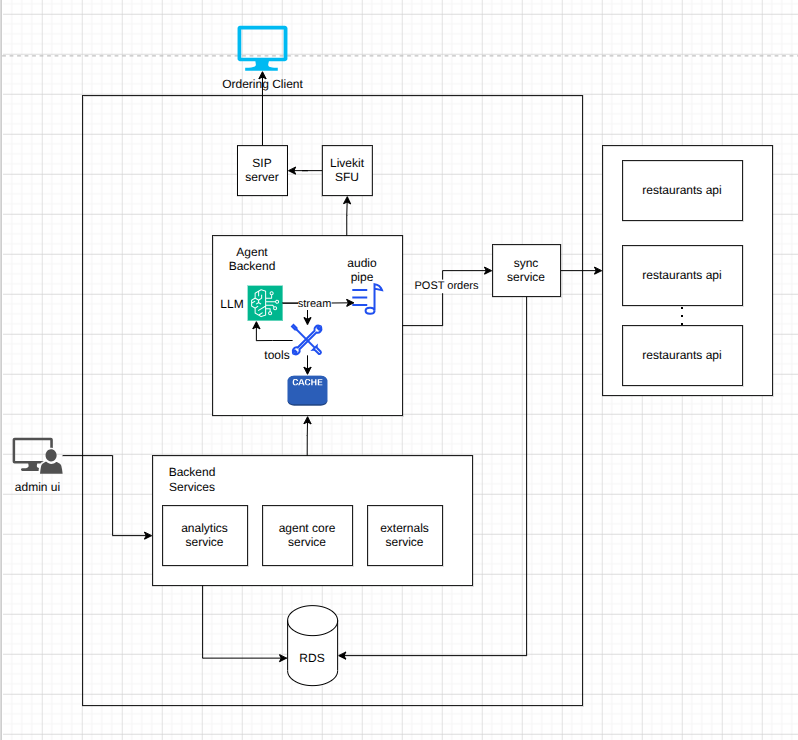

# VOCODINE ARCHITECTURE

!!! note "Implementation status (2026-05)"
    The orchestration layer was migrated off LangGraph onto the **LiveKit Agents SDK**, the LLM moved
    to **Google Vertex AI Gemini**, TTS moved to **Deepgram**, and the database in use is **Supabase
    PostgreSQL** (not NeonDB). The rendered diagram below may still show the older design; the prose
    on this page reflects the running code. See [ADR-006](../decisions/006-livekit-over-langgraph.md)
    and [sequence](sequence.md).

## High level diagram

---

## Call flow

Caller → Twilio SIP / WebRTC → LiveKit Cloud → Deepgram STT (nova-3) → Vertex AI Gemini (LiveKit Agents) → Deepgram TTS (aura-2) → Caller
                                                                  ↓
                                               backend-services (FastAPI, `/agent/*`, header `X-Agent-Key`)
                                                                  ↓
                                               Supabase / PostgreSQL (Source of Truth)
                                                                  ↓
                                               POS sync via `sync-service` (see ADR-003)
                                                                  ↓
                                               WhatsApp/SMS order confirmation + feedback (planned, see ADR-005)

The voice agent holds the menu and cart in process memory for the call and persists everything through
`backend-services` over HTTP: the menu is fetched once at call start, the call row and every
transcript/metric/cart event are written as it goes, and the order is created on confirmation.

## Conversation orchestration (LiveKit Agents SDK)

Orchestration is **not** a LangGraph state machine. It is a single, prompt-driven LiveKit
`Assistant(Agent)` (`voice-agent-backend/src/assistant.py`) that exposes a flat set of function
tools. The conversation flow is driven by the system prompt and by the `status` each tool returns —
there are no coded graph nodes, no checkpointing, and no upselling step.

    greet (on_enter) → browse one category at a time → add / modify / remove items
        → read back order + total → ask pickup or delivery → (delivery) require + confirm address
        → require + validate phone → confirm_order → goodbye   (request_handoff escalates anytime)

Function tools: `add_item`, `remove_item`, `modify_item`, `get_item_details`, `get_category_items`,
`get_order_summary`, `confirm_order`, `request_handoff`. Menu grounding is structural — an item the
agent can't resolve against the fetched menu returns `off_menu`/`ambiguous` rather than being added.
Every non-success tool result also carries an **`agent_action`** field: a plain-language instruction
telling the LLM what to do next (re-ask for a missing field, read candidates back, offer
alternatives), so recovery doesn't hinge on the model inferring intent from a bare status code.
`confirm_order` will not POST until the cart is non-empty, a delivery order has an address, and a
phone number with a plausible digit count (10–15) is present — otherwise it bounces back `empty`,
`need_address`, `need_phone`, or `invalid_phone` for the agent to recover from.

See [ADR-006](../decisions/006-livekit-over-langgraph.md) for why LangGraph was dropped.

## Data Layer

**Supabase (PostgreSQL)** is the source of truth for all persistent data: tenants, stores, menu
structure, item modifiers, prices, call logs, call events, order history, and feedback. The data
model is a strict hierarchy — **Tenant → Store → everything** — and `backend-services` resolves the
voice agent's POS `external_id`s to internal UUIDs on write. `sync-service` (a separate worker) also
writes this database directly via raw asyncpg.

There is **no Redis cache today**. [ADR-004](../decisions/004-redis-menu-cache.md) specifies Redis as
a per-call menu read cache, but it is not implemented: the agent fetches the full menu once from
`GET /agent/menu` and keeps it in process memory for the call's lifetime. That is functionally
equivalent for a single process but is not shared across replicas and does not survive a restart.

## Menu Context Strategy

The full menu is fetched once per call (`GET /agent/menu`) and cached in process memory. It is then
surfaced into the LLM context in three tiers to keep token usage low and latency fast.
(`voice-agent-backend/src/menu/lookup.py`.)

### Tier 1 — Compact menu (always in the system prompt)

The full menu — every available item name and base price, grouped by category — goes in the prompt
(`format_compact_menu`), one line per category. The agent is told this is its **only source of truth
for what exists**: anything not listed here (or returned by a tool) is off-menu and must not be
invented. Carrying names and prices in-context lets the LLM ground simple requests and read items
back without a tool round-trip, while staying compact enough to remain provider-cached.

    Mezze & Starters: Bruschetta ($8.99), Caesar Salad ($10.99), Hummus Trio ($12.99)
    Mains: Chicken Shawarma Bowl ($17.99), Grilled Salmon ($22.99), Lamb Kofta ($19.99)
    Sweets: Baklava ($8.99), Tiramisu ($9.99)

This matches the Tier-1 definition in [ADR-002](../decisions/002-tiered-menu-context.md) ("names,
categories, prices"). An earlier revision trimmed Tier 1 to category names only (`format_categories`)
to stop the agent reciting the menu, but that forced a tool call even for "what do you have?" and is
no longer used.

### Tier 2 — Category detail (on-demand tool call)

`get_category_items(category)` (`category_listing`) still exists and returns the available items +
prices for one category as a tool call. With the full compact menu now in Tier 1, the prompt steers
browsing to the in-prompt menu (read one category back at a time, never the whole menu at once), so
this tool is mostly a structured fallback rather than the primary browse path.

### Tier 3 — Item detail (on-demand tool call)

When a customer asks about modifiers, allergens, or descriptions, the agent calls
`get_item_details(item_name)`. Only the requested item's data enters context. In the running code
this resolves against the **in-memory menu** (a dict traversal), not Redis — cheaper than ADR-002
describes, but with no fallback to canonical data if the cached menu drifts mid-call. The
`GET /agent/menu/items` endpoint exists for a true round-trip but is currently unused.

See [ADR-002](../decisions/002-tiered-menu-context.md) for why a vector DB was not placed in the
critical path.
