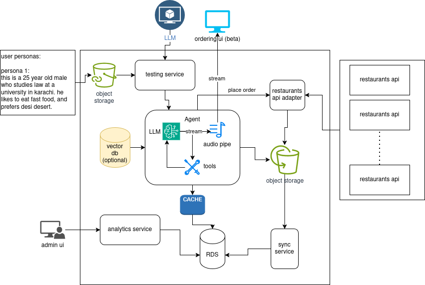

# VOCODINE ARCHITECTURE

!!! note "Implementation status (2026-05)"
    The orchestration layer was migrated off LangGraph onto the **LiveKit Agents SDK**, the LLM moved
    to **Google Vertex AI Gemini**, TTS moved to **Deepgram**, and the database in use is **Supabase
    PostgreSQL** (not NeonDB). The rendered diagram below may still show the older design; the prose
    on this page reflects the running code. See [ADR-006](../decisions/006-livekit-over-langgraph.md)
    and [sequence](sequence.md).

## High level diagram

[Open architecture diagram](https://viewer.diagrams.net/?tags=%7B%7D&lightbox=1&highlight=0000ff&edit=_blank&layers=1&nav=1&title=murtazafyp.drawio&dark=auto#R%3Cmxfile%3E%3Cdiagram%20name%3D%22Page-1%22%20id%3D%22tF0qvQm7hVIkew5gyeCA%22%3E7Rxbc%2BK6%2Bddk5vQhHt8NjyGXnnay07Q5Z9p9YoQtQBtjuZIIYX99JVu%2ByQIM2IHNNJsN9ocky9%2F9Zt8496uPvxKQLr%2FhCMY3thl93DgPNzb%2F8V3%2BISDbHGKNAiuHLAiKJKwCvKKfUAJNCV2jCNLGQIZxzFDaBIY4SWDIGjBACN40h81x3LxqChawBXgNQdyG%2FhtFbJlDR55ZwX%2BHaLEsrmyZ8psVKAZLAF2CCG9qIOfxxrknGLP8aPVxD2OBvQIv%2BbynHd%2BWGyMwYV0m%2FPnxY3yLl39%2FBr%2F%2FmX77A%2BDN95dby8%2BXgVELDdW6EkTxmoRw32KeHMi2BfrEuq%2FyFBO2xAucgPixgk4IXicRFHs0%2BVk15hnjlAMtDvwBGdtK1gBrhjloyVax%2FJZvk2z%2FUz%2F5LhYzvOL04UMunp9t5ZlkJkAWkO25Ka8kFWdyiFeQr8HnERgDht6bSAOS2RbluIoe%2FECS5BjyeLupUSG5icLNEjH4moKMVBsulk105bPfQbyWsyUAEgY%2Faldo3%2FKyxuf2SHL1phIKK5AwuYxfiMK2OB8KS2bvWJqjOL7HMSb8PMEJ7A1xbtBGnGc2ETdq4s0dCm92n8JvX1T2zeFkv0HzNBYcY5uYRJAcoRkkZU3D8dxRg7rWHurKxV8w4tSohuD5nPJ918h%2FRwjY1kakYgbVLCH34RSKpdiEYyrclK9Y8VZ5g2ew2%2FhXZ7eObGOPPslmfI%2F%2Fa9NRNKYvP5J%2Frtm3JdmYt4W%2F8eXR7DhalXwpW20fZ4Ssw0YIxGiR8OOQL8i1TV8myPI0tnvcNEGlWioUxGDG2%2BmCNu47p%2BIw3MaI4484h5E3yzH9PCsBIHxbZPj%2Fx5rxZaCE05wNLU%2BH4H89vJ6EY4175DUx7NhNDDvj0UAYdnv3jlpoIpAysCYgMzomSNFJSPM1fGkrPqWCtWAotjzS8e4gzfuR5sf8KpMIvfPDhTjMkGiCCKRC9uX3%2FFZqQ%2FpCsuK3u74i%2B%2BZQSA6%2BMGdag7ntoy%2BMteEE%2Bhjns%2BbtJNGdyCLdlGFgBOiyFPkaDgX8BTAurEkGsU1hpCgj%2BK3MHNkt76gKYKqY5ftNLbg5L4AJtB7DfqoVdkrrNWnsWYfApSD26ACxc3dUzqqnspSFAkdZyFYWyhHTWqivSMYKjmCmQy72RZJmHfknd7HP8Kj19HODZvjJ41HD%2B1QK2m6PFCwzvF8p93HZWKpTRu%2BzooJ6MvDGdubzuR2GpXKvfRP5M9%2FzdQb1HYYME42bF834wN9wypAg%2Fl96dPQ0IYjfNL6W6rKMvaHo2cnYnudO020SahBMIXlHImc3JGI9r4FY17cbiB0utitSAP3oMY3%2Fc7H6zR4t5tmVknuBBHFUivTIMdrtXLt2HtE6efA410f3ZWHTrHuf4kTwLQo5qsEMxi%2BYIqFE%2BHczzBhe1QbcyUQSEyRpp5VqxChU6upjIQq6BthQxwhBuITTBEewrQztx8CZjDicj48QX3GYqsnBdIpaNHGcoQKJYuF%2BRG50WdehGXXsEzrzF5E4bU7cGvVIsyLvfJUee3EXV5IUd7qld98gC5cFbnR6b44rzSK0jmM%2FiV3s0jqKkgru7izLb3lsakQ%2FkE4Ve5dkteziXN68uCSgaX6jc%2FQh9jHJqneQPL5DkX%2FZqZhdQziv63TKj6fykK7TlDPXdI7JFKzAT5xMqaNTw3j2Q1xUkAET0QNzilr2xm21PFY8ISVS70Mt68tefUZ0zmU7WUzDPkovd9UNF9UEn5BRZ5AylCzEkoXXP0zasiyXDd3a4vRZM3f8KzZczkUbrQrU%2FN9ODWGn%2BG3CaR5FUGfKsfYGo2kEGKBQTNxtndrRfGGteovmNcVwJbSwTKcp7ENlSZxevdTgmoXdv6iw91933C9tMZwzHZuvqSjtmikklGOZ3%2BadhuUL0IyoEJX7W1PlwvwSVm3tg9PYEomyX%2FZHTObOCGd%2BCMReRf%2B0aG6ORRfcZokznK25bhODY7ARU5ict044KQlXTYK0KOF%2F3gDhWgAZmQyKCegtm8jEOjCbOAc0%2B8CYX%2BherJSIK6YEzvla%2FCiCFOUfHOdGj5qgaIJrGH5FF9x%2BVm%2Bm6%2FSoC9zLJvaOzDL8Eg6Du4ccFZbRKnu8QGM6a0kUfjWUUljLq%2BxtAiufI2jlAxXnw7WDYDLh8Fj4CJOy0FEMieAcrDPhUS0%2F5XqO%2B9F%2FZIQW4aO8jwe04s71U4xm%2FC%2BarYTQcSsuECie%2FDDo%2B0Kn5p6fv%2FXliCsVDFspBN8O5oi7R3ZRnRK%2BAC5dW25G6CcEMGr32WB9F67XpyJzL6vIuqqxX71C4fbZ4OBeJOwcuDyec%2BLF6HN8uLojWNthSuolIV0sGithZ2md%2BopLlcjYs8Q%2FTXy5oiGABt1SBlfTfLYBohVKpiFOKI4LDVrTsuJb4Z2e1tRWZAo08WKhS0f2%2BWTXlzG6UP0gBTqHLZXLoWMBhUKmOXl8snUZgJ9rAo0Qr9J1vpqOE1tU0oQl2TM3eXpP0M78bQYZ2NkxcUYcdQJXFFZuT7%2B36qr0ETpoueTEp7q0a11JqUu7t%2FbTWZ%2Bkkvdh6liNnG3Dm%2FBfzg73%2BX%2FvQUS%2BHCLKAG2gDha0gVZ7GP%2BwdFdQgTpY0AZa7WHirNh1E6iDBV57x%2BpsSzPbUmbz3yPzsarysu5Go4eWpsubvfjPNWZftZlWAnOR%2Flso9jPhp%2FmRUjeEEcHhm17vnmIT29rPaXZElQqyfA%2BAZ1juuPrpoUFKK5adwjaNRdxJ2RYNd0TXdd7Rc0O7N7zFfaY5Mp%2FMvZ6aygYI08BAwvkxEsyg1t72QnR7bAQtslfAwuy5XKJrdB5fiA86VR%2B%2FKB%2BIF2bQSzOCrZRMbd80rB4qKVpqnxi%2B7uOcK2kFOPRgSMeUw24X5lL%2B04m1r%2BvxWmskM327mXTwTX9Aun1WKkIfk8pwQ76AB8wKlGta%2BPcRXiFWpncPZMJVdbpCUZTTElL0U%2B6k7Wk%2F6PwernIhWHXWf%2Fte8nDLFZtZZGi6PxRzq1Co%2FZaHEx5%2B0ZPsxA7WfQ7WdZSWhtSOx3BC%2F1IWnCllBc2%2FlJiZluU2nYrOQvcJUmZ3cTk5BlgT%2F7qq0cEEnAQdQbuGCLbodLeA8sG7o2PBw0U75ek%2Fq4%2BGGj0JOiVlrpQEYB0h0RaRovS0MuBhSji28hzmYA651SkOv1JKnFq%2F7iAKyivSyr7S%2FgnQKQC%2BUgLoepSymLa%2FBH4HYVFeiVO2uh9BK35avfAxNzTVezOdx%2F8B%3C%2Fdiagram%3E%3C%2Fmxfile%3E)

---

## Call flow

Caller → Twilio SIP / WebRTC → LiveKit Cloud → Deepgram STT (nova-3) → Vertex AI Gemini (LiveKit Agents) → Deepgram TTS (aura-2) → Caller
                                                                  ↓
                                               backend-services (FastAPI, `/agent/*`, header `X-Agent-Key`)
                                                                  ↓
                                               Supabase / PostgreSQL (Source of Truth)
                                                                  ↓
                                               POS sync via `sync-service` (see ADR-003)
                                                                  ↓
                                               WhatsApp/SMS order confirmation + feedback (planned, see ADR-005)

The voice agent holds the menu and cart in process memory for the call and persists everything through
`backend-services` over HTTP: the menu is fetched once at call start, the call row and every
transcript/metric/cart event are written as it goes, and the order is created on confirmation.

## Conversation orchestration (LiveKit Agents SDK)

Orchestration is **not** a LangGraph state machine. It is a single, prompt-driven LiveKit
`Assistant(Agent)` (`voice-agent-backend/src/assistant.py`) that exposes a flat set of function
tools. The conversation flow is driven by the system prompt and by the `status` each tool returns —
there are no coded graph nodes, no checkpointing, and no upselling step.

    greet (on_enter) → browse one category at a time → add / modify / remove items
        → read back order + total → ask pickup or delivery → (delivery) require + confirm address
        → require + validate phone → confirm_order → goodbye   (request_handoff escalates anytime)

Function tools: `add_item`, `remove_item`, `modify_item`, `get_item_details`, `get_category_items`,
`get_order_summary`, `confirm_order`, `request_handoff`. Menu grounding is structural — an item the
agent can't resolve against the fetched menu returns `off_menu`/`ambiguous` rather than being added.
Every non-success tool result also carries an **`agent_action`** field: a plain-language instruction
telling the LLM what to do next (re-ask for a missing field, read candidates back, offer
alternatives), so recovery doesn't hinge on the model inferring intent from a bare status code.
`confirm_order` will not POST until the cart is non-empty, a delivery order has an address, and a
phone number with a plausible digit count (10–15) is present — otherwise it bounces back `empty`,
`need_address`, `need_phone`, or `invalid_phone` for the agent to recover from.

See [ADR-006](../decisions/006-livekit-over-langgraph.md) for why LangGraph was dropped.

## Data Layer

**Supabase (PostgreSQL)** is the source of truth for all persistent data: tenants, stores, menu
structure, item modifiers, prices, call logs, call events, order history, and feedback. The data
model is a strict hierarchy — **Tenant → Store → everything** — and `backend-services` resolves the
voice agent's POS `external_id`s to internal UUIDs on write. `sync-service` (a separate worker) also
writes this database directly via raw asyncpg.

There is **no Redis cache today**. [ADR-004](../decisions/004-redis-menu-cache.md) specifies Redis as
a per-call menu read cache, but it is not implemented: the agent fetches the full menu once from
`GET /agent/menu` and keeps it in process memory for the call's lifetime. That is functionally
equivalent for a single process but is not shared across replicas and does not survive a restart.

## Menu Context Strategy

The full menu is fetched once per call (`GET /agent/menu`) and cached in process memory. It is then
surfaced into the LLM context in three tiers to keep token usage low and latency fast.
(`voice-agent-backend/src/menu/lookup.py`.)

### Tier 1 — Compact menu (always in the system prompt)

The full menu — every available item name and base price, grouped by category — goes in the prompt
(`format_compact_menu`), one line per category. The agent is told this is its **only source of truth
for what exists**: anything not listed here (or returned by a tool) is off-menu and must not be
invented. Carrying names and prices in-context lets the LLM ground simple requests and read items
back without a tool round-trip, while staying compact enough to remain provider-cached.

    Mezze & Starters: Bruschetta ($8.99), Caesar Salad ($10.99), Hummus Trio ($12.99)
    Mains: Chicken Shawarma Bowl ($17.99), Grilled Salmon ($22.99), Lamb Kofta ($19.99)
    Sweets: Baklava ($8.99), Tiramisu ($9.99)

This matches the Tier-1 definition in [ADR-002](../decisions/002-tiered-menu-context.md) ("names,
categories, prices"). An earlier revision trimmed Tier 1 to category names only (`format_categories`)
to stop the agent reciting the menu, but that forced a tool call even for "what do you have?" and is
no longer used.

### Tier 2 — Category detail (on-demand tool call)

`get_category_items(category)` (`category_listing`) still exists and returns the available items +
prices for one category as a tool call. With the full compact menu now in Tier 1, the prompt steers
browsing to the in-prompt menu (read one category back at a time, never the whole menu at once), so
this tool is mostly a structured fallback rather than the primary browse path.

### Tier 3 — Item detail (on-demand tool call)

When a customer asks about modifiers, allergens, or descriptions, the agent calls
`get_item_details(item_name)`. Only the requested item's data enters context. In the running code
this resolves against the **in-memory menu** (a dict traversal), not Redis — cheaper than ADR-002
describes, but with no fallback to canonical data if the cached menu drifts mid-call. The
`GET /agent/menu/items` endpoint exists for a true round-trip but is currently unused.

See [ADR-002](../decisions/002-tiered-menu-context.md) for why a vector DB was not placed in the
critical path.
