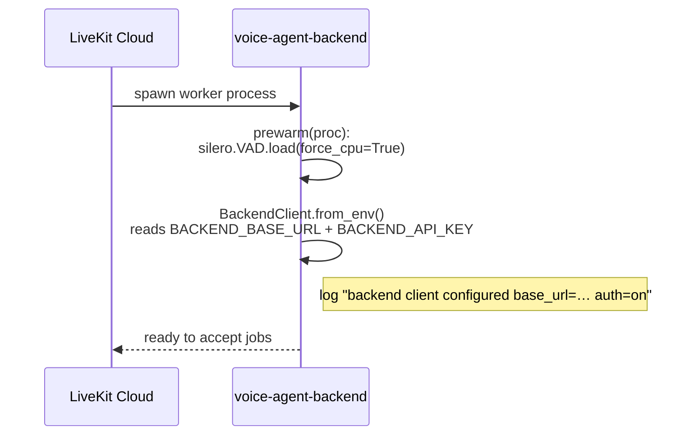
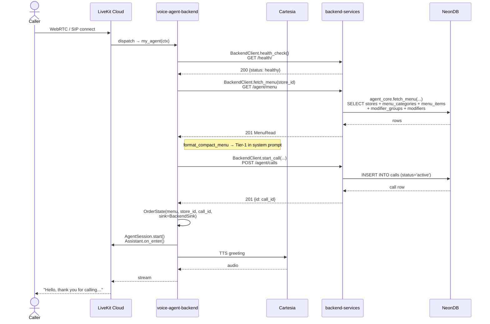
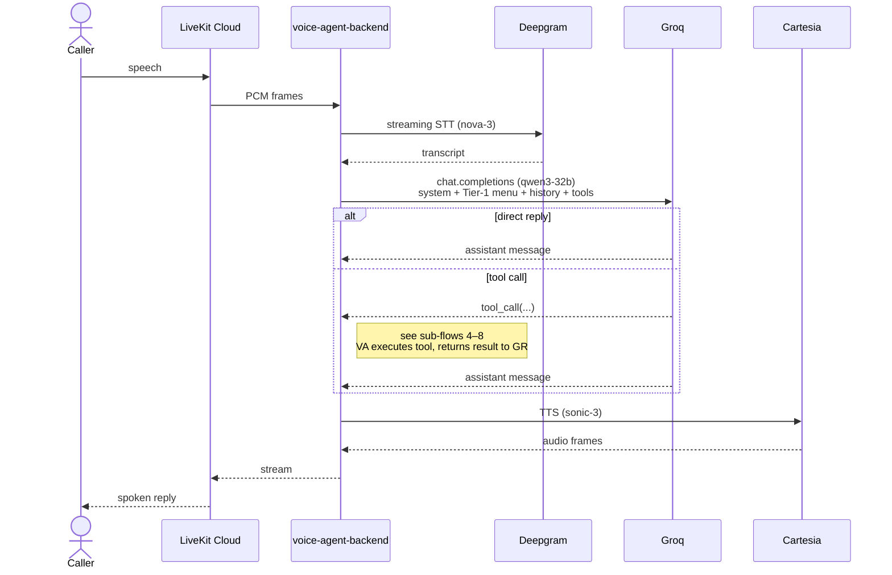
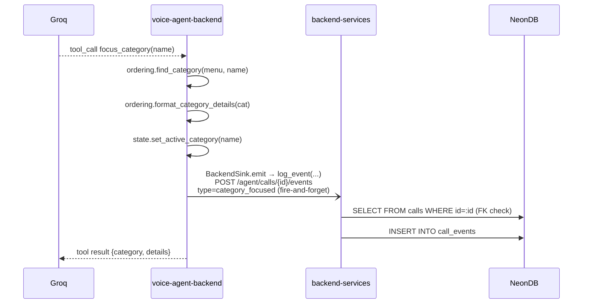
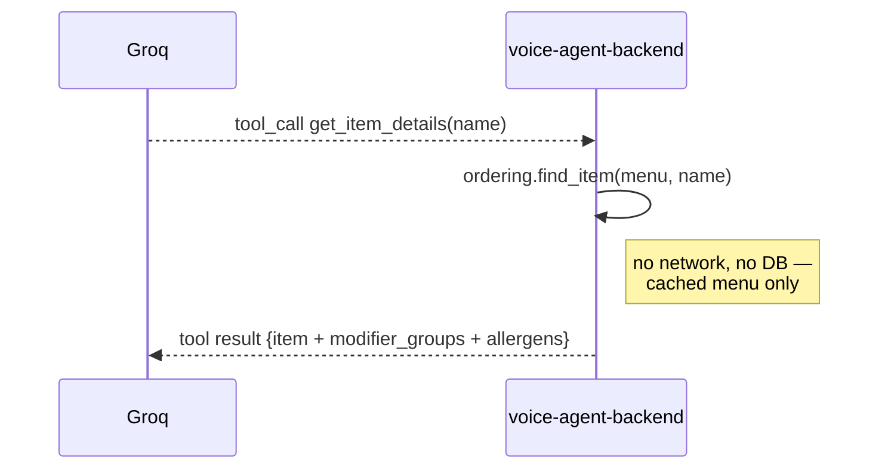
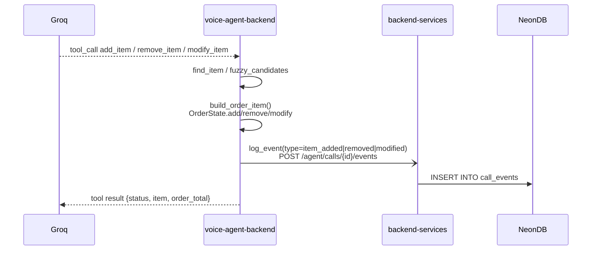
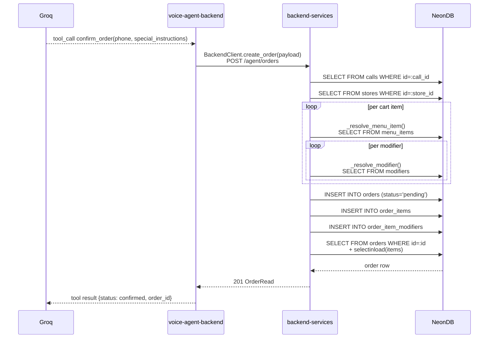
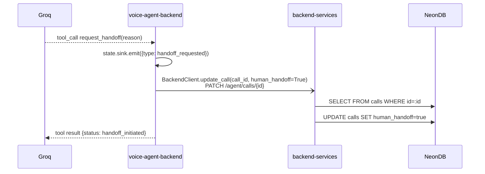
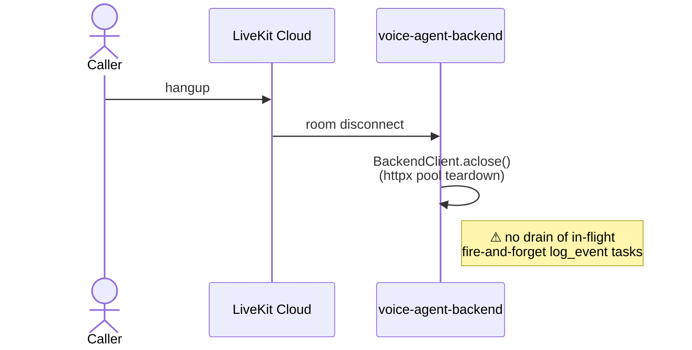

# Sequence Diagram

End-to-end sequence for one phone/WebRTC call through the VocoDine stack. Reflects the implementation as of 2026-05 in `voice-agent-backend/src/agent.py`, `voice-agent-backend/src/backend_client.py`, `voice-agent-backend/src/ordering.py`, and `backend-services/app/api/routes/agent_tools.py` — not aspirational architecture. Where the running code diverges from an ADR, that gap is called out at the bottom of the page.

## Participants

| Symbol | Component |
|---|---|
| Caller | Phone / WebRTC client |
| LK | LiveKit Cloud (WebRTC transport, agent dispatch) |
| VA | `voice-agent-backend` (LiveKit Agents process) |
| DG | Deepgram (streaming STT, `nova-3`) |
| GR | Groq (LLM, `qwen3-32b` via `lk_groq.LLM`) |
| CT | Cartesia (TTS, `sonic-3`) |
| BS | `backend-services` (FastAPI, async SQLAlchemy) |
| DB | NeonDB (PostgreSQL — source of truth) |

## Sub-flows

The combined diagram further down captures everything in one stack. If that's hard to read end-to-end, walk through these slices first — each focuses on one boundary in the call lifecycle and only shows the participants that matter for that slice.

### 1. Worker warm-up — once per process

LiveKit dispatches one OS process per worker. Before any session lands, `prewarm` loads the VAD model and constructs the HTTP client. No network calls leave the box at this stage.

### 2. Session bootstrap — caller connects → agent is ready to speak

Everything that has to happen *before* the agent can take its first turn. Three round-trips to `backend-services`: health, menu, call-create. The menu fetch dominates session-start latency (cold Neon query ≈1.5–2 s).

### 3. One conversational turn — speech in, speech out

The per-utterance loop. The LLM either replies directly (happy path shown here) or emits a tool call (sub-flows 4–8). STT is streaming and `preemptive_generation=True` lets the LLM start before STT closes — that overlap isn't shown but is real.

### 4. Tool: `focus_category` — Tier 2 (category narrowing)

Triggered when the customer narrows to a category ("what pizzas do you have?"). All menu work happens in-memory; the only network call is a fire-and-forget telemetry event.

### 5. Tool: `get_item_details` — Tier 3 (single item)

Pure in-memory lookup. The aspirational Redis path (ADR-004) and the dormant `GET /agent/menu/items` endpoint are not used today.

### 6. Tool: cart mutation — `add_item` / `remove_item` / `modify_item`

The customer is editing the order. Cart state lives in `OrderState` (in-memory); every edit fires a fire-and-forget `call_events` insert so the dashboard / analytics can replay the call.

### 7. Tool: `confirm_order` — finalize and persist

The only point in the call where the cart actually becomes durable. Synchronous (the agent waits) because the customer needs to hear an order ID or a failure. Per cart line and per modifier we resolve back to the canonical row to validate prices and IDs.

### 8. Tool: `request_handoff` — human escalation

The agent gives up. A telemetry event is recorded locally and a fire-and-forget PATCH flips `human_handoff` on the call row.

### 9. Session teardown — caller hangs up

## Full call sequence

```mermaid
sequenceDiagram
    autonumber
    actor Caller
    participant LK as LiveKit Cloud
    participant VA as voice-agent-backend
    participant DG as Deepgram
    participant GR as Groq
    participant CT as Cartesia
    participant BS as backend-services
    participant DB as NeonDB

    rect rgb(245, 245, 220)
    Note over Caller,DB: Process startup (once per worker)
    VA->>VA: prewarm(proc):<br/>silero.VAD.load()<br/>BackendClient.from_env()
    end

    rect rgb(230, 240, 255)
    Note over Caller,DB: Session start (per call)
    Caller->>LK: WebRTC / SIP connect
    LK->>VA: dispatch → my_agent(ctx)

    VA->>BS: BackendClient.health_check()<br/>GET /health/
    BS-->>VA: 200 {status: healthy}
    Note right of VA: log "backend health check OK"

    VA->>BS: BackendClient.fetch_menu(store_id)<br/>GET /agent/menu?store_id=…<br/>(X-Agent-Key)
    BS->>BS: require_agent_key()<br/>agent_tools.get_menu()<br/>→ agent_core.fetch_menu(db, store_id)
    BS->>DB: SELECT * FROM stores WHERE id=:store_id
    DB-->>BS: store row
    BS->>DB: SELECT * FROM menu_categories<br/>WHERE store_id=:id AND is_active=true<br/>+ selectinload(items)
    DB-->>BS: categories + items
    BS->>DB: SELECT * FROM modifier_groups<br/>JOIN modifier_group_items<br/>+ selectinload(modifiers)
    DB-->>BS: groups + modifiers
    BS-->>VA: 201 MenuRead
    Note right of VA: ordering.format_compact_menu(menu)<br/>→ Tier-1 block in system prompt

    VA->>BS: BackendClient.start_call(store_id, sid, phone)<br/>POST /agent/calls
    BS->>BS: agent_tools.post_call()<br/>→ agent_core.create_call(db, payload)
    BS->>DB: INSERT INTO calls<br/>(store_id, twilio_call_sid, caller_phone, status='active')
    DB-->>BS: call row
    BS-->>VA: 201 {id: call_id}

    VA->>VA: OrderState(menu, store_id, call_id, sink=BackendSink)
    VA->>LK: AgentSession.start()<br/>Assistant.on_enter()
    VA->>CT: TTS "Hello, thank you for calling…"
    CT-->>VA: audio frames
    VA-->>LK: stream
    LK-->>Caller: greeting
    end

    rect rgb(240, 255, 240)
    Note over Caller,DB: Per-turn loop
    Caller->>LK: speech
    LK->>VA: PCM frames
    VA->>DG: streaming STT (nova-3)
    DG-->>VA: transcript
    VA->>GR: lk_groq.LLM.chat (qwen3-32b)<br/>system+history+Tier-1 menu+tools
    GR-->>VA: assistant msg OR tool_call
    end

    rect rgb(255, 245, 230)
    Note over VA,DB: Tool branches

    alt focus_category(name) — Tier 2
        VA->>VA: ordering.find_category(menu, name)<br/>ordering.format_category_details(cat)<br/>state.set_active_category(name)
        VA-)BS: BackendSink.emit → BackendClient.log_event(call_id)<br/>POST /agent/calls/{id}/events<br/>type=category_focused (fire-and-forget)
        BS->>BS: agent_core.create_call_event(db, call_id, payload)
        BS->>DB: SELECT * FROM calls WHERE id=:call_id (existence check)
        BS->>DB: INSERT INTO call_events<br/>(call_id, event_type, payload)
        VA-->>GR: tool result {category, details}

    else add_item / remove_item / modify_item
        VA->>VA: find_item / fuzzy_candidates<br/>build_order_item()<br/>OrderState.add/remove/modify
        VA-)BS: log_event(type=item_added|removed|modified)<br/>POST /agent/calls/{id}/events
        BS->>DB: INSERT INTO call_events
        VA-->>GR: tool result {status, item, order_total}

    else get_item_details(name) — Tier 3
        VA->>VA: ordering.find_item(menu, name)<br/>(in-memory only — no network)
        VA-->>GR: tool result {item + modifier_groups + allergens}

    else get_order_summary
        VA->>VA: OrderState.summary()
        VA-->>GR: tool result {items[], total}

    else confirm_order(phone, instructions)
        VA->>BS: BackendClient.create_order(payload)<br/>POST /agent/orders
        BS->>BS: agent_tools.post_order()<br/>→ agent_core.create_order(db, payload)
        BS->>DB: SELECT * FROM calls WHERE id=:call_id
        BS->>DB: SELECT * FROM stores WHERE id=:store_id
        loop per cart item
            BS->>DB: _resolve_menu_item()<br/>SELECT * FROM menu_items WHERE external_id=… OR id=…
            loop per modifier
                BS->>DB: _resolve_modifier()<br/>SELECT * FROM modifiers WHERE external_id=… OR id=…
            end
        end
        BS->>DB: INSERT INTO orders<br/>(call_id, store_id, total_amount, phone, status='pending')
        BS->>DB: INSERT INTO order_items (one per line)
        BS->>DB: INSERT INTO order_item_modifiers (one per modifier)
        BS->>DB: SELECT * FROM orders WHERE id=:id<br/>+ selectinload(items)
        DB-->>BS: order row
        BS-->>VA: 201 OrderRead
        VA-->>GR: tool result {status: confirmed, order_id}

    else request_handoff(reason)
        VA->>VA: state.sink.emit({type: handoff_requested})
        VA-)BS: BackendClient.update_call(call_id, human_handoff=True)<br/>PATCH /agent/calls/{id}
        BS->>BS: agent_core.update_call(db, call_id, payload)
        BS->>DB: SELECT * FROM calls WHERE id=:call_id
        BS->>DB: UPDATE calls SET human_handoff=true WHERE id=:call_id
        VA-->>GR: tool result {status: handoff_initiated}
    end
    end

    rect rgb(240, 255, 240)
    Note over Caller,DB: Response back to caller
    GR-->>VA: assistant message (post tool result)
    VA->>CT: cartesia.TTS (sonic-3)
    CT-->>VA: audio frames
    VA-->>LK: stream audio
    LK-->>Caller: spoken reply
    end

    rect rgb(255, 230, 230)
    Note over Caller,DB: Session end
    Caller->>LK: hangup
    LK->>VA: room disconnect
    VA->>VA: BackendClient.aclose()<br/>(httpx pool teardown)
    end
```

## Tables touched per flow

| Flow | Tables read | Tables written |
|---|---|---|
| `fetch_menu` | `stores`, `menu_categories`, `menu_items`, `modifier_groups`, `modifier_group_items`, `modifiers` | — |
| `start_call` | — | `calls` |
| `log_event` (every tool emit) | `calls` (FK existence) | `call_events` |
| `create_order` (`confirm_order`) | `calls`, `stores`, `menu_items`, `modifiers`, `orders` | `orders`, `order_items`, `order_item_modifiers` |
| `update_call` (`request_handoff`) | `calls` | `calls` |
| `get_item_details`, `focus_category`, `get_order_summary`, cart-side of `add_item`/`remove_item`/`modify_item` | — (in-memory menu only) | — |

## Function map (voice-agent ↔ backend-services)

| voice-agent call site | HTTP | backend-services route | service function |
|---|---|---|---|
| `BackendClient.health_check()` | `GET /health/` | `health.health_check()` | — |
| `BackendClient.fetch_menu(store_id)` | `GET /agent/menu` | `agent_tools.get_menu()` | `agent_core.fetch_menu()` |
| `BackendClient.fetch_item(store_id, name)` | `GET /agent/menu/items` | `agent_tools.get_menu_item()` | `agent_core.fetch_menu_item_by_name()` |
| `BackendClient.start_call(...)` | `POST /agent/calls` | `agent_tools.post_call()` | `agent_core.create_call()` |
| `BackendClient.update_call(call_id, **fields)` | `PATCH /agent/calls/{id}` | `agent_tools.patch_call()` | `agent_core.update_call()` |
| `BackendClient.log_event(call_id, ...)` | `POST /agent/calls/{id}/events` | `agent_tools.post_call_event()` | `agent_core.create_call_event()` |
| `BackendClient.create_order(payload)` | `POST /agent/orders` | `agent_tools.post_order()` | `agent_core.create_order()` |

Note: `BackendClient.fetch_item` exists on the agent side but **is not invoked anywhere today** — `get_item_details` reads from the in-memory menu instead. The route is live and tested; it's just dead code as far as the agent is concerned.

## Implementation gaps vs. ADRs

The diagram is honest about what's wired today; these are the places the current implementation differs from documented intent:

1. **No Redis layer.** [ADR-004](../decisions/004-redis-menu-cache.md) specifies Redis as the per-call read cache. Today the agent holds the menu dict in process memory for the session lifetime — functionally equivalent for one process but doesn't survive process restarts and isn't shared across replicas.
2. **Tier-3 is in-process, not a network fetch.** [ADR-002](../decisions/002-tiered-menu-context.md) describes `get_item_details` as a "single Redis lookup." In code it's a pure dict traversal of the cached menu. Cheaper than the ADR specifies, but no fallback to canonical data if the cached menu drifts mid-call.
3. **Event writes are fire-and-forget.** `BackendSink.emit` schedules `asyncio.create_task` and returns immediately. The tool path doesn't await it. On session shutdown there's no drain step, so a tail of late `call_events` inserts can be cancelled silently. Acceptable for analytics today, not acceptable once `call_events` becomes load-bearing.
4. **Existence check before every `call_event` insert.** `create_call_event` does a `SELECT * FROM calls WHERE id=:id` before each `INSERT INTO call_events`. Cheap (PK lookup) but it's per-event write amplification — worth knowing if event volume rises.
5. **Item availability not filtered on the agent side.** `menu_categories` is filtered by `is_active=true` server-side, but the agent iterates all items in `format_category_details` and only filters `is_available` on modifiers. Items flagged `is_available=false` in the DB still appear in Tier-2 detail blocks until the menu is re-fetched.
6. **STT/LLM/TTS shown sequentially.** In reality Deepgram streams and `preemptive_generation=True` lets the LLM start while the user is still finishing. Mermaid can't express that cleanly without losing the per-turn structure, so the diagram is linearised. See [audio-pipe](audio-pipe/audio-pipe.md) for the real-time flow.
